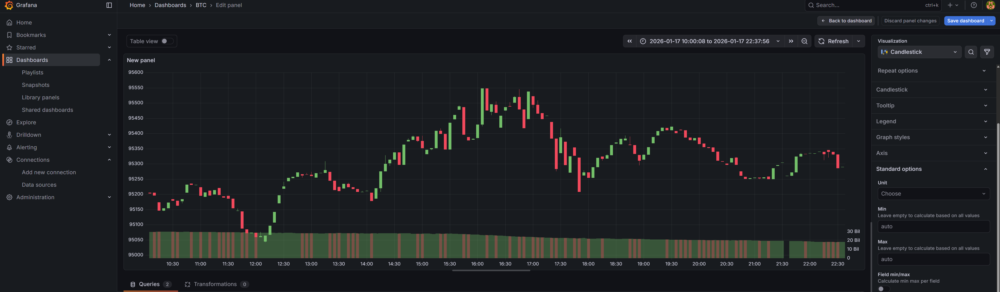
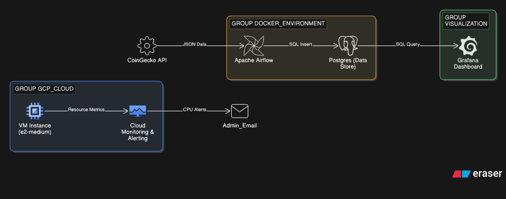

# Crypto Pulse - Real-Time Data Pipeline

A comprehensive system for monitoring and analyzing cryptocurrency market data in real-time. The project integrates data acquisition, relational storage, and advanced visualization technologies.

## System Architecture

The system is built on three main technological pillars:

### 1. Ingestion Layer (Python)
The Python script functions as an ETL (Extract, Transform, Load) processor:
* **Extraction:** Fetching raw market data (price, volume, percentage change) from external REST APIs.
* **Transformation:** Data type validation and mapping into the database schema.
* **Loading:** Asynchronous transmission of records to the PostgreSQL database.

### 2. Storage Layer (PostgreSQL & Docker)
Data is stored in a structured SQL database running within a containerized environment:
* **Data Model:** The `f_btc_realtime` fact table stores the history of price changes over time.
* **Indexing:** Utilization of `fetch_timestamp` for optimized time-range queries.
* **Containerization:** Full isolation of the database and application using Docker Compose.


### 3. Visualization & Analytics Layer (Grafana)
The Grafana interface is used for trend monitoring and technical analysis:
* **SQL Queries:** Dynamic data retrieval using template variables (e.g., `$ticker`).
* **Time Series Analysis:** Real-time visualization of asset value changes with flexible time-range filtering.
* **Data Exploration:** Identification of market patterns and price anomalies.

## Dashboard Preview


## Google Cloud Platform Architecture

## Tech Stack
* **Language:** Python (Requests, Psycopg2)
* **Database:** PostgreSQL 15+
* **Visualization:** Grafana
* **Infrastructure:** Docker, Docker Compose

## Quick Start
To launch the entire technology stack, execute the following command in the terminal:
```bash
docker-compose up -d
